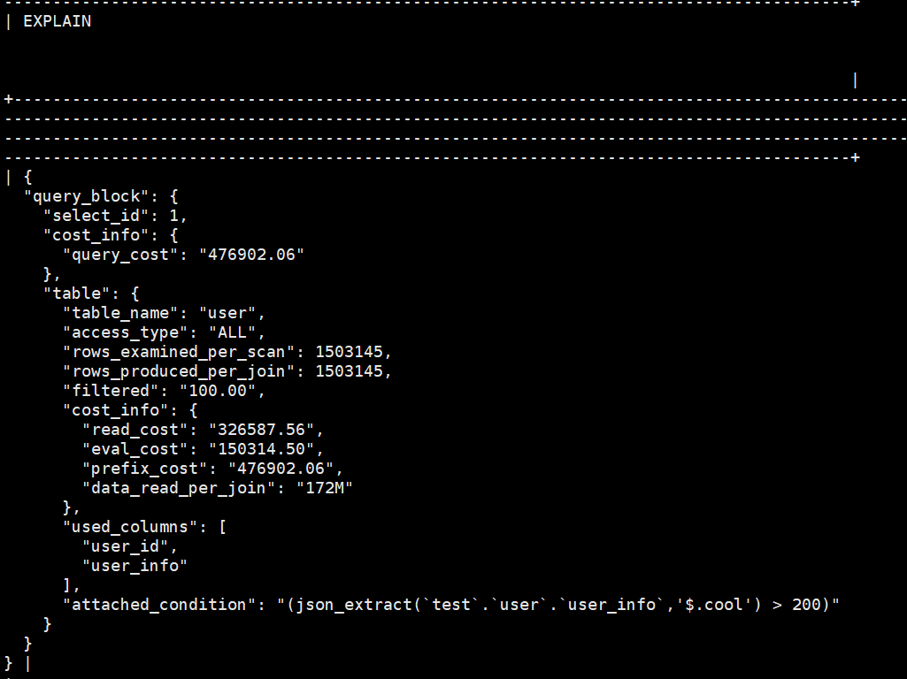
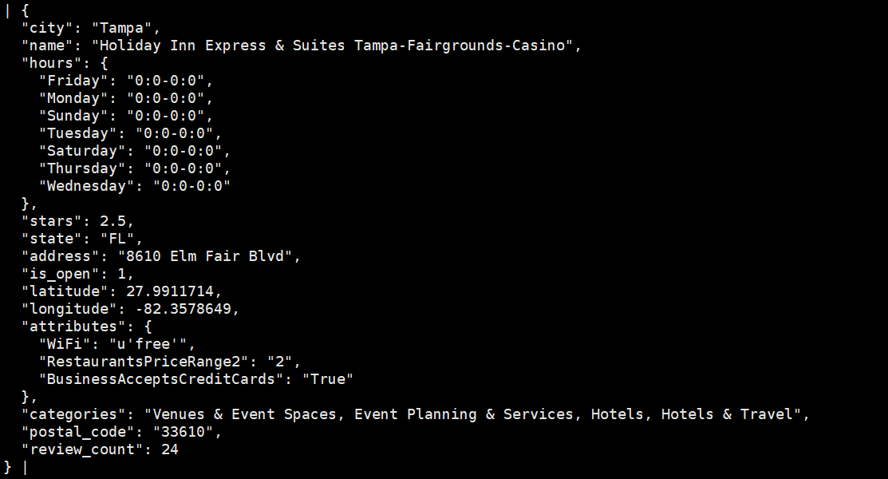

# MySQL

```sql
mysql -u root -p

1.

SELECT 
    business_id,
    JSON_PRETTY(business_info) AS business_info
FROM 
    business
WHERE 
    JSON_EXTRACT(business_info, '$.state') = 'CA'
ORDER BY 
    JSON_UNQUOTE(JSON_EXTRACT(business_info, '$.stars')) DESC
LIMIT 5;

2.

SELECT 
    JSON_KEYS(JSON_EXTRACT(business_info, '$.attributes')) AS attr_keys,
    JSON_LENGTH(JSON_EXTRACT(business_info, '$.attributes')) AS attr_num
FROM 
    business
WHERE 
    JSON_UNQUOTE(JSON_EXTRACT(business_info, '$.city')) = 'Edmonton'
LIMIT 5;

3.

SELECT 
    JSON_EXTRACT(business_info, '$.name') AS name,
    JSON_TYPE(JSON_EXTRACT(business_info, '$.name')) AS name_type,
    JSON_EXTRACT(business_info, '$.stars') AS stars,
    JSON_TYPE(JSON_EXTRACT(business_info, '$.stars')) AS stars_type,
    JSON_EXTRACT(business_info, '$.hours') AS hours,
    JSON_TYPE(JSON_EXTRACT(business_info, '$.hours')) AS hours_type,
    JSON_EXTRACT(business_info, '$.latitude') AS latitude,
    JSON_TYPE(JSON_EXTRACT(business_info, '$.latitude')) AS latitude_type
FROM 
    business
LIMIT 5;

4.

SELECT 
    JSON_UNQUOTE(JSON_EXTRACT(business_info, '$.name')) AS name,
    JSON_EXTRACT(business_info, '$.city') AS city,
    JSON_EXTRACT(business_info, '$.stars') AS stars,
    JSON_EXTRACT(business_info, '$.attributes.WiFi') AS wifi_status
FROM 
    business
WHERE 
    JSON_UNQUOTE(JSON_EXTRACT(business_info, '$.state')) = 'FL'
AND 
    JSON_EXTRACT(business_info, '$.attributes.HasTV') = 'True'
ORDER BY 
    JSON_UNQUOTE(JSON_EXTRACT(business_info, '$.stars')) DESC
LIMIT 20;

5.

EXPLAIN FORMAT = JSON
SELECT * FROM user
WHERE JSON_EXTRACT(user_info, '$.cool') > 200;

结果如下：

{
  "query_block": {
    "select_id": 1,
    "cost_info": {
      "query_cost": "476902.06"
    },
    "table": {
      "table_name": "user",
      "access_type": "ALL",
      "rows_examined_per_scan": 1503145,
      "rows_produced_per_join": 1503145,
      "filtered": "100.00",
      "cost_info": {
        "read_cost": "326587.56",
        "eval_cost": "150314.50",
        "prefix_cost": "476902.06",
        "data_read_per_join": "172M"
      },
      "used_columns": [
        "user_id",
        "user_info"
      ],
      "attached_condition": "(json_extract(`test`.`user`.`user_info`,'$.cool') > 200)"
    }
  }
}
运行完后：26981 rows in set (32.91 sec)


mongodb:
db.user.find({ "cool": { $gt: 200 } });
db.user.find({ "cool": { $gt: 200 } }).explain("executionStats");

(b)
6.
修改前查询：
SELECT JSON_PRETTY(business_info) AS original_info
FROM business
WHERE business_id = '--eBbs3HpZYIym5pEw8Qdw';

结果如下：

{
  "city": "Tampa",
  "name": "Holiday Inn Express & Suites Tampa-Fairgrounds-Casino",
  "hours": {
    "Friday": "0:0-0:0",
    "Monday": "0:0-0:0",
    "Sunday": "0:0-0:0",
    "Tuesday": "0:0-0:0",
    "Saturday": "0:0-0:0",
    "Thursday": "0:0-0:0",
    "Wednesday": "0:0-0:0"
  },
  "stars": 2.5,
  "state": "FL",
  "address": "8610 Elm Fair Blvd",
  "is_open": 1,
  "latitude": 27.9911714,
  "longitude": -82.3578649,
  "attributes": {
    "WiFi": "u'free'",
    "RestaurantsPriceRange2": "2",
    "BusinessAcceptsCreditCards": "True"
  },
  "categories": "Venues & Event Spaces, Event Planning & Services, Hotels, Hotels & Travel",
  "postal_code": "33610",
  "review_count": 24
}

UPDATE business
SET business_info = JSON_SET(
    business_info,
    '$.attributes.BikeParking', 'True',
    '$.review_count', 42,
    '$.attributes.WiFi', 'Paid'
)
WHERE business_id = '--eBbs3HpZYIym5pEw8Qdw';

SELECT JSON_PRETTY(business_info) AS pretty_business_info
FROM business
WHERE business_id = '--eBbs3HpZYIym5pEw8Qdw';

7.

SELECT JSON_PRETTY(user_info)
FROM user
WHERE user_id = '--agAy0vRYwG6WqbInorfg';

插入新记录
INSERT INTO user (user_id, user_info)
SELECT 'change', user_info
FROM user
WHERE user_id = '--agAy0vRYwG6WqbInorfg';

删除 fans 和 useful
UPDATE user  
SET user_info = JSON_REMOVE(user_info, '$.fans', '$.useful')
WHERE user_id = 'change';

添加 city 键值对
UPDATE user
SET user_info = JSON_SET(user_info, '$.city', 'New York')
WHERE user_id = 'change';

SELECT JSON_PRETTY(user_info)
FROM user
WHERE user_id = 'change';

DELETE FROM user WHERE user_id = 'change';

8.

SELECT
    b.state,
    JSON_OBJECTAGG(b.city, city_count) AS cities_count
FROM (
    SELECT
        JSON_UNQUOTE(JSON_EXTRACT(business_info, '$.state')) AS state,
        JSON_UNQUOTE(JSON_EXTRACT(business_info, '$.city')) AS city,
        COUNT(*) AS city_count
    FROM
        business
    GROUP BY
        state, city
) AS b
GROUP BY
    b.state
ORDER BY
    b.state ASC;

9.

SELECT
    user_id,
    JSON_ARRAYAGG(
        JSON_OBJECT(
            'date', JSON_UNQUOTE(JSON_EXTRACT(tip_info, '$.date')),
            'text', JSON_UNQUOTE(JSON_EXTRACT(tip_info, '$.text')),
            'compliment_count', JSON_UNQUOTE(JSON_EXTRACT(tip_info, '$.compliment_count'))
        )
    ) AS tips
FROM
    tip
GROUP BY
    user_id
LIMIT 5;

10.

SELECT
    JSON_EXTRACT(business_info, '$.name') AS name,
    JSON_EXTRACT(business_info, '$.attributes.WiFi') AS WiFi,
    JSON_EXTRACT(business_info, '$.attributes.DogsAllowed') AS DogsAllowed,
    JSON_EXTRACT(business_info, '$.attributes.HasTV') AS HasTV
FROM
    business
WHERE
    JSON_EXTRACT(business_info, '$.city') = 'Edmonton'
    AND JSON_OVERLAPS(
        JSON_OBJECT('WiFi', 'u\'no\'', 'DogsAllowed', 'True', 'HasTV', 'False'),
        JSON_OBJECT(
            'WiFi', JSON_EXTRACT(business_info, '$.attributes.WiFi'),
            'DogsAllowed', JSON_EXTRACT(business_info, '$.attributes.DogsAllowed'),
            'HasTV', JSON_EXTRACT(business_info, '$.attributes.HasTV')
        )
    )
ORDER BY
    name ASC
LIMIT 10;

11.

SELECT
    JSON_UNQUOTE(JSON_EXTRACT(user_info, '$.name')) AS name,
    CAST(JSON_UNQUOTE(JSON_EXTRACT(user_info, '$.funny')) AS UNSIGNED) AS funny,
    CAST(JSON_UNQUOTE(JSON_EXTRACT(user_info, '$.useful')) AS UNSIGNED) AS useful,
    CAST(JSON_UNQUOTE(JSON_EXTRACT(user_info, '$.cool')) AS UNSIGNED) AS cool,
    JSON_ARRAY(
        CAST(JSON_UNQUOTE(JSON_EXTRACT(user_info, '$.funny')) AS UNSIGNED),
        CAST(JSON_UNQUOTE(JSON_EXTRACT(user_info, '$.useful')) AS UNSIGNED),
        CAST(JSON_UNQUOTE(JSON_EXTRACT(user_info, '$.cool')) AS UNSIGNED),
        CAST(
            CAST(JSON_UNQUOTE(JSON_EXTRACT(user_info, '$.funny')) AS UNSIGNED) +
            CAST(JSON_UNQUOTE(JSON_EXTRACT(user_info, '$.useful')) AS UNSIGNED) +
            CAST(JSON_UNQUOTE(JSON_EXTRACT(user_info, '$.cool')) AS UNSIGNED)
            AS DECIMAL(10, 1)
        )
    ) AS '[funny, useful, cool, sum]'
FROM
    user
WHERE
    CAST(JSON_UNQUOTE(JSON_EXTRACT(user_info, '$.useful')) AS UNSIGNED) > 1000
LIMIT 10;

12.

SELECT 
    JSON_PRETTY(
        JSON_MERGE_PRESERVE(
            (SELECT JSON_UNQUOTE(business_info) FROM business WHERE business_id = '-1b2kNOowsPrPpBOK4lNkQ'),
            (SELECT JSON_UNQUOTE(user_info) FROM user WHERE user_id = '--7XOV5T9yZR5w1DIy_Dog')
        )
    ) AS merged_info;

13.

SELECT 
    JSON_UNQUOTE(JSON_EXTRACT(business_info, '$.name')) AS business_name,
    JSON_UNQUOTE(JSON_EXTRACT(business_info, '$.attributes.HasTV')) AS HasTV,
    ROW_NUMBER() OVER (PARTITION BY JSON_UNQUOTE(JSON_EXTRACT(business_info, '$.name')) ORDER BY attr.attribute_value) AS num,
    attr.attribute_value
FROM (
    SELECT 
        business_info
    FROM business
    ORDER BY JSON_EXTRACT(business_info, '$.review_count') DESC
    LIMIT 3
) AS t
JOIN JSON_TABLE(
    t.business_info,
    '$.attributes.*' COLUMNS (
        attribute_value VARCHAR(255) PATH '$'
    )
) AS attr ON true
ORDER BY business_name ASC;
1. 内层查询执行：首先，`business`表中的数据按`review_count`降序排序，并返回前三条记录的`business_info`字段。返回结果是一个包含`business_info`字段的结果集。
2. `JSON_TABLE`展开：然后，`JSON_TABLE`函数处理这些`business_info`字段，将其中的`attributes`字段展开成表格形式。每个属性变成单独的行，并且`attribute_value`字段提取属性值。
3. 外层查询：接着，外层查询处理这些展开的数据：
   - 提取`business_name`和`HasTV`属性。
   - 计算每个业务的属性值行号（`ROW_NUMBER()`），按`attribute_value`排序。
   - 返回每条记录的`attribute_value`。
4. 排序：最后，结果按`business_name`进行升序排序。
```
